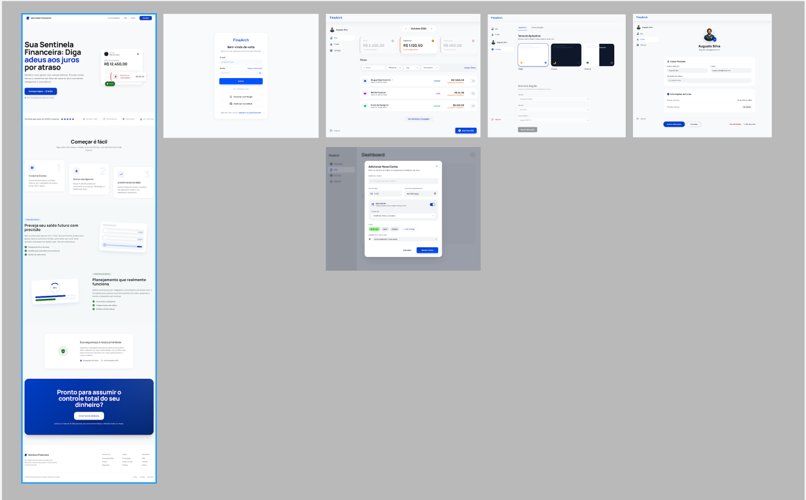

# 📊 Frontend System Design: Account Manager

## 1. Requirements (Requirements)
---

### 1.1 Functional (Core Features)

- [x] **Account Management (Core)**  
  Full CRUD for accounts with metadata (tags, recurrence, and amounts).

- [x] **Recurrence Engine**  
  Logic for projecting and visualizing cash flow (past months, current month, and +12 months).

- [x] **Reactive Dashboard**  
  Interface with time navigation and summary cards that filter the list by status on click.

- [x] **Search and Filtering**  
  Text search engine and quick filters by due date and taxonomy (customizable tags).

- [x] **Notification Engine**  
  Automatic reminder scheduling system via email and Telegram.

- [x] **Theming & UX**  
  Persistent dark/light mode support and visual feedback (skeletons, toasts).

---

### 1.2 Non-Functional (Quality)

- **Performance:**  
  Good Web core vitals, Caching, Code splitting.

- **Responsiveness:**  
  Mobile-first strategy.

- **Accessibility:**  
  WCAG 2.1 AA

- **i18n:**  
  Multi-language support (Next-i18n) and currency/timezone localization.

- **Security/Auth:**  

---

## 2. Architecture

**Goal:** Design the macro structure and communication between the parts of the system.

---

### 2.1 Overview

- **Main Framework:**  
  Next.js (App Router) + Typescript + Tailwind CSS

- **Hybrid Rendering Strategy:**
  - SSG → Static pages  
  - SSR → Initial dashboard rendering  
  - CSR → Client-side interactions  

- **Tooling:**
  - Storybook → UI development  
  - Vite + Vitest → Testing  
  - React Query -> Caching and requests
  - Zustand -> State management
  - Next-i18n
  - Sonner Toast library
  - eslint-plugin-boundaries //Follow FSD architecture
  - React Hook Form + zod
### 2.2 Project structure

This project follows **Feature-Sliced Design (FSD)** — a methodology that organizes code by **business domain and responsibility**, not by file type.

> 📖 Official docs: https://feature-sliced.design

---

#### Folder Structure

```
my-app/
├── app/                              ← Next.js App Router (routing only)
│   ├── [route-name]/
│   │   ├── page.tsx                  ← re-exports from src/pages/[name]
│   │   └── layout.tsx
│   └── layout.tsx                    ← root layout (mounts global Providers)
│
├── pages/                            ← empty folder, required by Next.js
│   └── README.md                     ← explains why this folder exists
│
├── src/                              ← all FSD layers live here
│   ├── app/               
│   │   ├── providers/
│   │   └── styles/
│   │
│   ├── pages/                   
│   │   └── [page-name]/
│   │       ├── index.ts              
│   │       └── ui/
│   │
│   ├── widgets/                   
│   │   └── [widget-name]/
│   │       ├── index.ts            
│   │       ├── ui/
│   │       └── model/
│   │
│   ├── features/                  
│   │   └── [feature-name]/
│   │       ├── index.ts         
│   │       ├── ui/
│   │       └── model/
│   │
│   ├── entities/                    
│   │   └── [entity-name]/
│   │       ├── index.ts       
│   │       ├── ui/
│   │       ├── model/
│   │       └── api/
│   │
│   └── shared/  
│       ├── ui/
│       ├── api/
│       ├── lib/
│       └── config/
│
├── middleware.ts                      ← Next.js (must be at root)
├── next.config.js
└── tsconfig.json
```

---

#### Layers

Layers are the top-level folders inside `src/`. Each layer has a fixed name and a fixed responsibility. **A layer can only import from layers below it** — never from layers above.

```
app → pages → widgets → features → entities → shared
```

---

#### `app`
**Entry point of the application.**

Holds everything needed to bootstrap the app: global providers, global styles, and initialization logic. Nothing here knows about specific business domains.

| Segment | What goes here |
|---|---|
| `providers/` | React context providers (QueryClient, Theme, Auth) |
| `styles/` | Global CSS files |

---

#### `pages`
**Full page components.**

Each slice is one route. Pages are thin — they only compose widgets together. Heavy logic stays in widgets, features, and entities.

> ⚠️ This is the **FSD** `pages` layer inside `src/`. It is different from the empty `/pages` folder at the root (which exists only to satisfy Next.js).

| Segment | What goes here |
|---|---|
| `ui/` | The page component (`DashboardPage.tsx`) |
| `model/` | Page-scoped state shared between two or more widgets on the same page (Context + Provider) |
| `index.ts` | Public API — re-exports the page component and Next.js `metadata` |

---

#### `widgets`
**Large, self-contained UI blocks.**

A widget delivers a complete use case on its own. It composes entities and features together. If a page has too much going on, it should be split into widgets.

| Segment | What goes here |
|---|---|
| `ui/` | The widget component |
| `model/` | Widget-scoped state shared between child components (Context + Provider, custom hooks) |
| `index.ts` | Public API |

---

#### `features`
**User-facing actions that bring business value.**

A feature is something the user *does*: submit a form, mark an item, apply a filter. Features are reusable across multiple widgets or pages.

| Segment | What goes here |
|---|---|
| `ui/` | The trigger component (button, form, toggle) |
| `model/` | Custom hooks, mutations, form state, validation logic |
| `index.ts` | Public API |

---

#### `entities`
**Business domain objects.**

An entity represents a core concept of the product: a user, an account, a transaction. It holds the shape of the data, its visual representation, and how to fetch it.

| Segment | What goes here |
|---|---|
| `ui/` | Visual representation of the entity (card, badge, avatar) |
| `model/` | TypeScript interfaces/types, Zustand store or Jotai atoms |
| `api/` | Fetch functions related to this entity |
| `index.ts` | Public API |

---

#### `shared`
**Reusable code with no business knowledge.**

Shared has no idea what kind of app this is. It only knows generic patterns. If a component or utility references any domain concept (account, user, transaction), it does not belong here.

| Segment | What goes here |
|---|---|
| `ui/` | Generic components: `Button`, `Input`, `Badge`, `Card` |
| `api/` | HTTP client setup (axios instance, fetch wrapper) |
| `lib/` | Pure utility functions: `formatDate`, `formatCurrency` |
| `config/` | Constants, route names, environment config |

---

#### Slices

Inside every layer (except `app` and `shared`), code is divided into **slices** — one folder per business domain.

```
entities/
├── user/         ← slice
├── account/      ← slice
└── transaction/  ← slice
```

Each slice exposes a single **public API** via its `index.ts`. External code must only import from that file — never from inside the slice directly.

```ts
// ✅ correct — imports from the public API
import { AccountCard } from '@/entities/account'

// ❌ wrong — bypasses the public API
import { AccountCard } from '@/entities/account/ui/AccountCard'
```

---

#### Segments

Inside each slice, code is divided into **segments** by technical purpose.

| Segment | Purpose |
|---|---|
| `ui/` |  components and styles |
| `model/` | State, hooks, types, Context, stores |
| `api/` | Fetch functions and HTTP logic |
| `lib/` | Helper functions used only within this slice |
| `config/` | Constants and configuration |

---

---

#### Inside Segments
   It will use colocation in order to organize components and business logic. We may have an extra folder depending on the situation or not.

   example:

      ui/ -> button/ -> button.tsx ; button.test.tsx ; button.stories.tsx

### 2.3 State management

- Client side -> Zustand -> Avoid re-renders
- Server side -> React Query -> Retry and caching


### 2.4 Design system 
  [Figma layouts file](https://www.figma.com/design/GWidckpZ8NDvWXEQnsXgmU/Untitled?node-id=0-1&t=zUIHVxNy3JRSHKQq-1)
   

### 2.5 High level architecture

   [High level Wireframe](https://gemini.google.com/share/d4dfaa223f0e)
   


## 3. Data Model

### 3.1 Typing

```ts
interface User {
  id: string
  email: string
  name: string
  timezone: string
  locale: string
  createdAt: Date
}

// account and accountInstance stay in the same entity
interface Account {
  id: string
  userId: string
  name: string
  amount: number
  dueDay: number                     
  recurrence: 'none' | 'weekly' | 'monthly' | 'yearly'
  tagIds: string[]
  description?: string
  isActive: boolean
  createdAt: Date
  updatedAt: Date
}

interface AccountInstance {
  id: string
  accountId: string
  userId: string
  amount: number   
  dueDate: Date
  paidAt?: Date
  status: 'pending' | 'paid' | 'overdue'
  period: Date      
}


interface Tag {
  id: string
  userId: string
  name: string
  color: string 
}

interface Notification {
  id: string
  userId: string
  accountId: string
  channel: 'email' | 'telegram'
  destination: string  
  triggerDaysBefore: number               
  wasSent: boolean
}
```

### 3.2 Backend Schema

┌─────────────────────────────────────────────────────────┐
│                    SCHEMA                      │
├─────────────────────────────────────────────────────────┤
│                                                         │
│   ┌─────────┐         ┌─────────────┐                   │
│   │  users  │───1:N──►│  accounts   │                   │
│   └─────────┘         │  (templates)│                   │
│                       └──────┬──────┘                   │
│                              │                          │
│                              │ 1:N                      │
│                              ▼                          │
│                       ┌─────────────┐                   │
│                       │AccountInstance│___              |
│                       │             │     |             │
│                       └──────┬──────┘     │             │
│                              │            │             │
│                              │ 1:N        │ N:M         │
│                              ▼            │             │
│                       ┌─────────────┐     │    ┌─────┐  │
│                       │notifications│     └───►│tags │  │
│                       └─────────────┘          └─────┘  │
│                                                         │
└─────────────────────────────────────────────────────────┘


# 4. Interface (API)

## 4.1 Communication Protocol

Communication exclusively via **HTTP/REST**. The frontend consumes an external API — there are no WebSockets or SSE because the system does not require real-time updates.

---

## 4.2 Communication Layers

```
UI
 ↓
Hooks (useQuery / useMutation)   → manage loading, error, cache
 ↓
Entity API (accountApi, tagApi)  → typed functions by entity
 ↓
Fetch Wrapper (shared/api)       → base URL, auth header, global error
```

---

## 4.3 Fetch Wrapper

Centralizes everything every request needs. Located in `shared/api/client.ts`.

fetchWrapper(url, options, config = { showToast: true })

---

## 4.4 Endpoints by Entity

Each entity owns its own endpoints. No other place in the project accesses these paths directly.

### Auth

Supabase

### Account

| Method | Path | Description |
|---|---|---|
| GET | `/accounts` | Lists all accounts |
| POST | `/accounts` | Creates an account |
| PATCH | `/accounts/:id` | Updates an account |
| DELETE | `/accounts/:id` | Deletes an account |
| GET | `/accounts/:id/instances` | Lists instances by period |
| PATCH | `/accounts/:id/instances/:instanceId/pay` | Marks as paid |

### Tag

| Method | Path | Description |
|---|---|---|
| GET | `/tags` | Lists all tags |
| POST | `/tags` | Creates a tag |
| DELETE | `/tags/:id` | Deletes a tag |

### Notification

| Method | Path | Description |
|---|---|---|
| GET | `/notifications` | Lists the user's notifications |
| POST | `/notifications` | Creates a notification |
| PATCH | `/notifications/:id` | Updates a notification |
| DELETE | `/notifications/:id` | Deletes a notification |

---

## 4.5 Query Hooks

Read hooks live in `entities/*/model/`. Responsibility: expose data to the UI with cache managed by React Query.

```ts
// entities/account/model/useAccounts.ts
export function useAccounts() {
  return useQuery({
    queryKey: ['accounts'],
    queryFn: accountApi.getAll,
    staleTime: 1000 * 60 * 5, // 5 min — instant navigation
  })
}

export function useAccountInstances(id: string, period: string) {
  return useQuery({
    queryKey: ['accounts', id, 'instances', period],
    queryFn: () => accountApi.getInstances(id, period),
    staleTime: 1000 * 60 * 2,
  })
}
```

---

## 4.6 Mutation Hooks

Mutations live in `features/*/model/`. Responsibility: execute user actions and invalidate cache surgically.

---

## 4.7 Inter-Component Communication (Client-Client)

| Mechanism | When to use |
|---|---|
| Props + callbacks | Direct parent → child communication |
| Zustand store | Global state — theme, selected period, active filters |
| React Query cache | Server state — invalidation automatically triggers re-renders |
---
